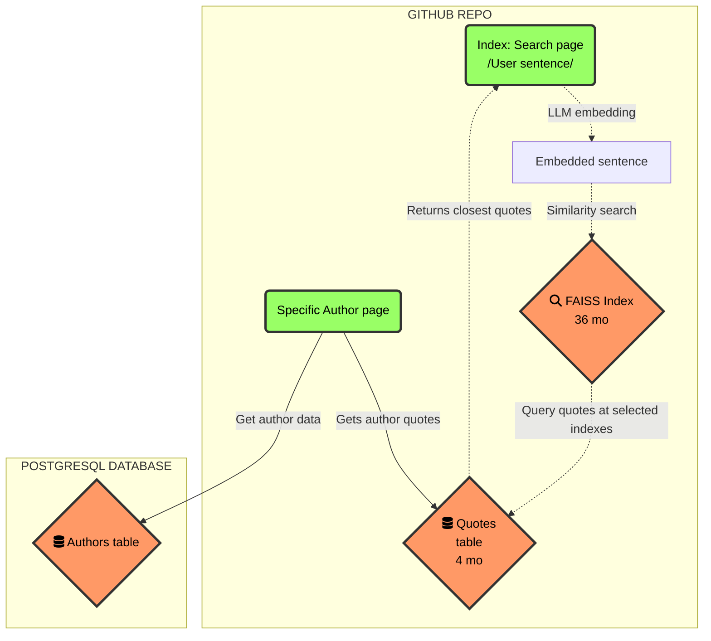

# What is Dixit ❔

> Disclaimer: we will quote historical people, so we give credits. ["Render unto Caesar"](https://en.wikipedia.org/wiki/Render_unto_Caesar) as they say.

Dixit is an online app that boost your confidence: when you have a smart idea, it lets you see which historical people came upon this same smart idea. "Great minds think alike", as they say 🧐.

But the truth is, these particular great minds probably formulated the idea way better than you could. So why not quote them directly, and ["stand on the shoulders of [these] giants"](https://en.wikipedia.org/wiki/Standing_on_the_shoulders_of_giants)?

Dixit lets you type in your poorly formulated, rough-edged idea, and through a ["tremendous"](https://www.theatlantic.com/magazine/archive/2018/03/how-to-talk-trump/550934/) ["AI powered semantic search"](https://www.reddit.com/r/consulting/comments/6x8a34/have_any_of_you_snakeoil_salesmen_ever_actually/), it retrieves a quote with a similar idea from its database of historical quotations.

# How it works

["A good sketch is worth a long speech"](https://en.wikipedia.org/wiki/Napoleon), so here's a graph of the system design.

# How it does not work

For now, it still has a limited database of quotes, so searching for the idea "NFT is a huge pile of scam" will return only remote ideas. But hey, we can't make coffee for you either.

# 