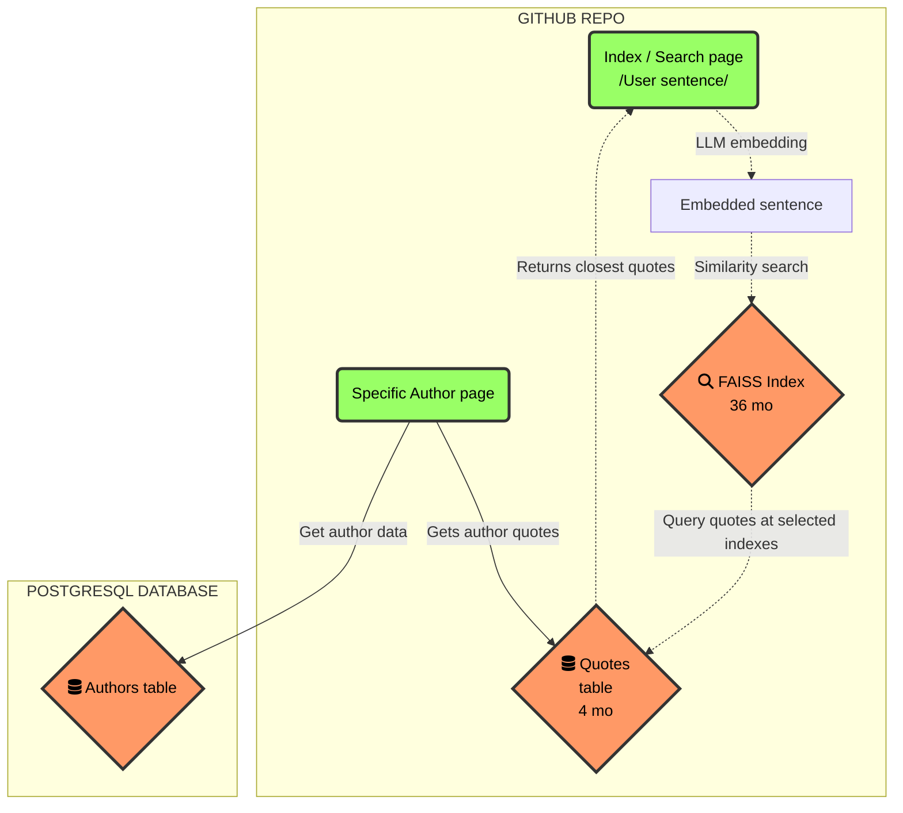

# What is Dixit❔

> Disclaimer: I will quote historical people, so I give credits. ["Render unto Caesar"](https://en.wikipedia.org/wiki/Render_unto_Caesar) as they say.

Dixit is an online app that boost your confidence: when you have a smart idea, it lets you see which historical people came upon this same smart idea. "Great minds think alike", as they say 🧐.

But the truth is, these particular great minds probably formulated the idea way better than you could. So why not quote them directly, and ["stand on the shoulders of [these] giants"](https://en.wikipedia.org/wiki/Standing_on_the_shoulders_of_giants)?

Dixit lets you type in your rough-edged idea, and through a ["tremendous"](https://www.theatlantic.com/magazine/archive/2018/03/how-to-talk-trump/550934/) ["AI powered semantic search"](https://www.reddit.com/r/consulting/comments/6x8a34/have_any_of_you_snakeoil_salesmen_ever_actually/), it retrieves the quotes from its database of historical quotations that best rephrase this idea ✨.

# How it works

The website is coded in [Django](https://www.djangoproject.com/), to make use of Python's powerful ML libraries. ["A good sketch is worth a long speech"](https://en.wikipedia.org/wiki/Napoleon), so here's a graph of the system design.

The continuous lines are actions performed by the `Specific author page` , while the dotted lines are actions performed by the `Index / Search page`. In particular, searching for a setnence triggers the following process:
1. Query sentence is embedded by a Large Language Model from the Huggingface library into the vector space
2. A similarity search based on Meta's library [FAISS](https://github.com/facebookresearch/faiss) returns the indexes of the closest quotes from database (which means the databse of quotes has been previously embedded into vector space).
3. The database of quotes is queried at these indexes, and the results are displayed to the user.

As you see above, the server is a clone of a Github repo that both hosts the FAISS index and the Quotes database: while this is certainly not the most storage-light option (and my `git push` commands are painful), I have good reasons to do this.

> My main constraints are: fast loading of the pages (my Railway hosting is a shared node), not eating up too much RAM (I don't want to pay), and being able to update the quotation database whenever I have new quotes.

- First, why separate Quotes database and FAISS index instead of using a single `Huggingface dataset` with an associated index? Well, this `dataset` class seems to have an implementation flaw preventing one to properly save a dataset with its index: I can either store it without index, then have to recompute the index on boot, which makes the page too slow, or pickle it but it's too heavy an object for my RAM. So I chose to keep a separate FAISS index which can be loaded up very quickly.
- But I want to keep them closeby, since whenever I add/remove a line in the quote database, I have to change the associated index with it.
- Why host the FAISS Index on Github repo: you can't perform FAISS search in a POSTGRESQL table, and remote hosting (like Pinecone) would add too much complexity to the system. Here, the index is light, so I kept things simple.
- Why host the Quotes database on Github repo: this allows quick versioning in case I want to add new quotations to the database + it's very light compared to the index (4mo vs 40mo), so it's not a huge burden in memory.

On the other hand, I hosted the `authors` table in the POSTGRESQL database proposed for free by Railway (❤), since this table won't change a lot, and this format makes it easily hostable / queriable.

### Services

- Website is hosted on the flawless [Railway](https://railway.app/). This provider gives immaculate service so far 🌟 + it's very inexpensive.
- Analytics: [Goatcounter](https://www.goatcounter.com/). I highly recommend it: it's GDPR compliant, uses no cookies, and is easy to setup as a single script in your `html` header.
- Domain name registration: [Google Domains](https://domains.google.com/registrar/). Obtaining a domain name works like a breeze with a Google account.
- DNS provider: [Cloudflare](https://www.cloudflare.com/). But then to work with Railway, I had to follow [this tutorial](https://postulate.us/@samsonzhang/postulate/p/2022-08-17-Deploying-to-custom-Google-Domain-oqJpcTW46qVU7vD4KFdyVx) with Cloudflare as a DNS provider. One little tweak to note: I had to change the SSL/TLS settings to "Full" encryption in Cloudflare for it to properly work.

# Paths for improvement

- Database of quotes has 24,000 quotes. This is a lot if you consider the fact that they're mostly intelligent sentences and not randomly picked, but its's not yet enough to capture all ideas. I'll add many more in the months to come.
- Due to high noise in our databases for recent quotes, I only kept the quotes from older authors, since I needed an automatable criterion and I think time helps a lot to separate the wheat from the chaff. But still, you're very welcome to also propose good recent quotes! (On a purely subjective basis)
- The LLM model used to embed user sentences into the search space is inherently limited in its representation: for instance, sometimes it can misinterpret the semantics of a query. But I am confident that as LLMs improve on semantic search, the results will become even more accurate.

# Try it out

The site is available at [dixit.app](dixit.app). Try it out, and please leave me some feedback! 😃